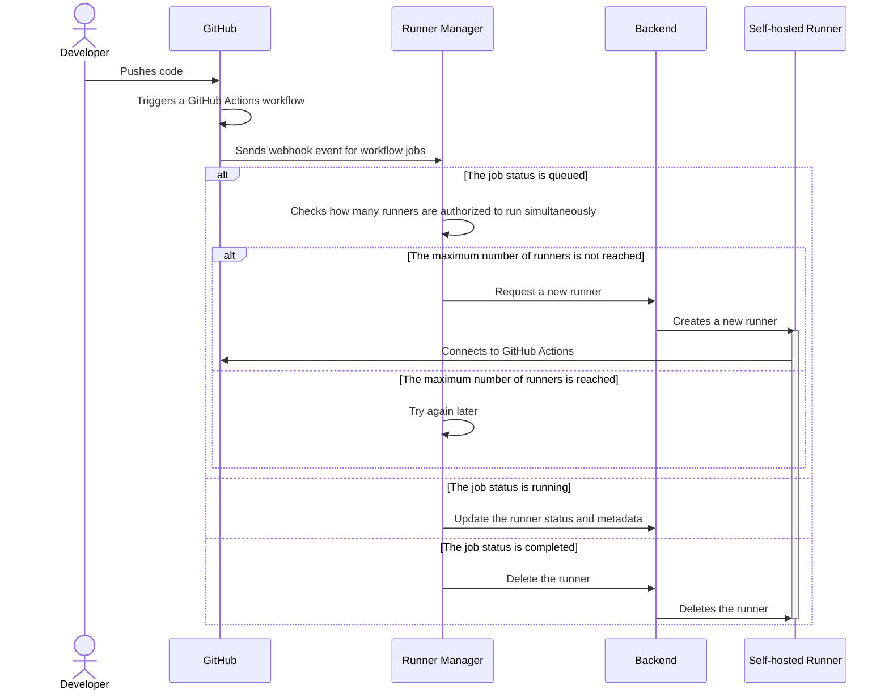

# Runner Manager Design

## Overview

By default, GitHub Actions runners are hosted by GitHub, but it is also
possible to host them on your own infrastructure, with [self-hosted runners].
The Runner Manager is a tool to handle the process of creating,
deleting and managing the state of self-hosted runners.

It is very similar to the [Actions Runner Controller (ARK)] with the
difference being that instead of focusing on Kubernetes (containers) as
backend to host the runners, it focuses on virtual machines.

## Workflow

### Webhook events

The Runner Manager will respond to webhook events coming from GitHub.



### Health checks

It will also periodically check the health of the runners and
perform actions based on the results of the health checks.

## Configuration

It can be configured as a GitHub Application (recommended for production)
but also with a GitHub Personal Access Token (recommended for development).

The configuration of the runner will be done through a YAML file and
a combination of environment variables for secrets.

### Global configuration

The global configuration will contain the following information:

- A name for the runner manager. (default: runner-manager)
  It will be used as a metadata or prefix which will allow the runner to identify
  the owner of each resources, avoiding conflicts with other runner managers or users.
- The GitHub Authentication parameters. (Required)
  - For GitHub Application: The GitHub Application ID, Installation ID and Private Key. (Required)
  - For GitHub Personal Access Token: The GitHub Personal Access Token. (Required)
- The Redis connection parameters. (Required)
- The backends configuration. (Required)
- The webhook secret. (Required)
- The runner groups. (Required)
- The health check interval. (Default: 10 minute)
- The runner's time to start. (Default: 10 minute)
- The runner's time to live. (Default: 12 hour)

### Runner groups

A list of runner groups will be configured into the runner manager
settings, each group will be matched with its appropriate [runner group]
in the GitHub organization or repository.

!!! note

    We use the term runner groups for consistency with GitHub Actions API.

The following information will be configured for each runner group:

- Name of the group. (Required)
- Name of the GitHub Organization in which the runner and group will be created. (Required)
- Name of the GitHub Repository in which the runner and group will be created. (Optional)
- Repository access:
  - A list of selected repositories. (Default: All repositories)
  - Allow public repositories. (Default: True)
- Workflow access: a comma separated list of the workflows that can access the runner group.
  For example:
  ```shell
  octo-org/octo-repo/.github/workflows/build.yml@v2,
  octo-org/octo-repo/.github/workflows/deploy.yml@d6dc6c96df4f32fa27b039f2084f576ed2c5c2a5,
  monalisa/octo-test/.github/workflows/test.yml@main
  ```
- The name of the workflow that will be used to run the jobs. (Optional)
- The maximum number of runners that can run simultaneously. (Default: 20)
- The minimum number of runners that must be available. (To be reviewed) (Default: 0)
- The runner labels that will be attached to the runners of the group. (Required)
- The runner backend that will be used to host the runners of the group. (Required)
- The runner's instance specifications (CPU, RAM, disk, etc). (Required)

## The backends

The runner manager supports multiple backends, which are responsible
for hosting the runners. The following backends will be supported:

- GCP
- AWS
- Docker (For local testing)

## The state

The runner manager needs to gather information that comes from both
GitHub and the backend that has been configured.

This data needs ideally to be persistent, so that the runner manager can
recover from a reboot or crash and not lose track of the runners
that are currently running.

Redis will be used as a database to store the state of the runners.

## The tasks

The runner manager will be responsible for tasks that are triggered
by events coming from GitHub as well as health checks that are
triggered periodically.

A proper task queue needs to be used to ensure that tasks are:

- Not lost if the runner manager crashes.
- Properly distributed between multiple runner manager instances.

Redis is used as a task queue backend, so that only one database server
is required.

## Configuration

### Runners groups

## Development

The Runner Manager is written in Python, typing will be used and enforced
by [pyright](https://github.com/microsoft/pyright).

All libraries must be compatible with [Pydantic](https://docs.pydantic.dev/).
This requirement will allow to have a nice developer experience
when writing the runner manager.

### Fastapi

[Fastapi](https://fastapi.tiangolo.com/) will be used as a web framework to
expose the API of the runner manager.

### GitHubkit

[GitHubkit](https://github.com/yanyongyu/githubkit) is a GitHub API client for
Python that works exactly like the official GitHub API client for JavaScript, Octokit.

Its code is generated from the OpenAPI specification of the GitHub API.

### Redis-om

[Redis-om](https://github.com/redis/redis-om-python) is a Redis Object Mapper
that allows to store and retrieve Python Pydantic objects in Redis.

This will enable fastapi objects to be stored in Redis and retrieved
without having to write boilerplate code.

## Testing

### Mocking

To mock GitHub's API we will use the openapi specification of the API
to generate a mock server that will be used in the unit tests.

The mock server will be generated using [prism](https://github.com/stoplightio/prism)
and will be run in a docker container.

Here's an example of a curl command that will create a new repository to a prism mock server:

```shell
curl -L \
  -X POST \
  -H "Content-Type: application/json" \
  "http://localhost:4010/orgs/scality/repos" \
  -d '{
    "name":"hello-world",
    "description":"This your first repo!",
    "homepage":"https://github.com",
    "private":false,
    "has_issues":true,
    "has_projects":true,
    "has_wiki":true
}'
```

### Unit tests

Unit tests will be written using [pytest](https://docs.pytest.org/en/stable/).

### Functional tests

Here's a description of the setup for the functional tests:

- Will be interacting with the real GitHub API.
- It will execute a [GitHub Actions] a real workflow and triggered by a workflow dispatch
- Webhooks notification will be sent thanks to the integration of webhook redirection in `gh` cli.
- Will have `docker` configured as a backend to host the runners.

[GitHub Actions]: https://docs.github.com/en/actions
[self-hosted runners]: https://docs.github.com/en/actions/hosting-your-own-runners/about-self-hosted-runners
[Actions Runner Controller (ARK)]: https://github.com/actions/actions-runner-controller/
[runner group]: https://docs.github.com/en/enterprise-cloud@latest/actions/hosting-your-own-runners/managing-self-hosted-runners/managing-access-to-self-hosted-runners-using-groups#about-runner-groups
