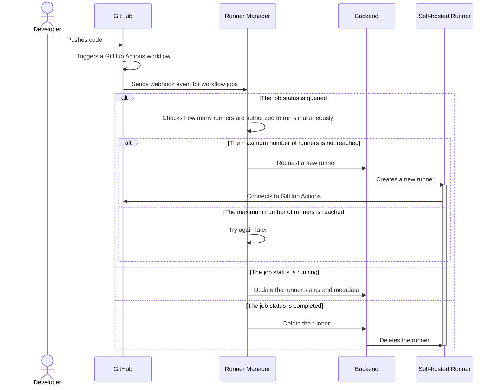
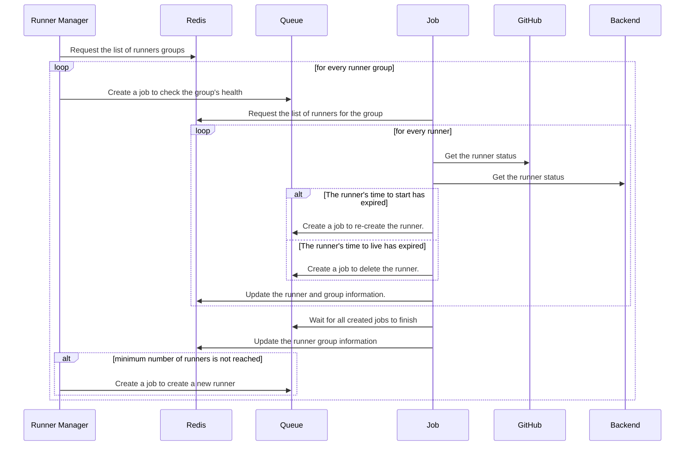

# Workflows

A high level description of the runner manager workflows.

## Webhook events

Webhook events are sent by GitHub on selected events, such as:

- Push to a repository
- Pull requests is merged
- A workflow is triggered

In the case of the runner manager, we are interested in `workflow_job` events
that are triggered when a job is queued, running or completed.

Here's a description of the workflow that is triggered by a `workflow_job` event:

## Health checks

It will also periodically check the health of the runners and
perform actions based on their status.

