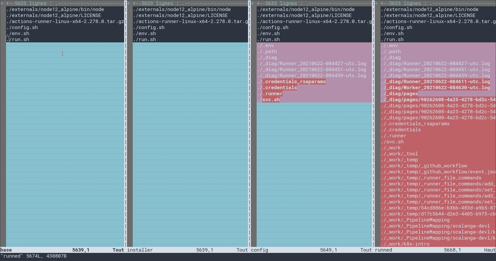
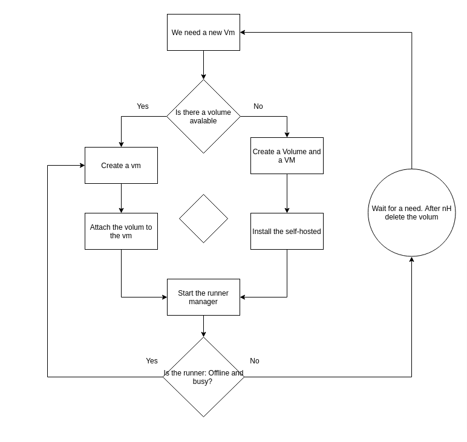

# Github Self-hosted `--once` error

### Self-hosted installation

### `--once` flag
After installing the self-hosted runner dependencies and configuring it. 
You can start him just with `./run.sh`.
Or add `--once` a non-official flag we can use to make sure the runner stops after executing one job.
The flag works as advertised but it is not officially maintained by GitHub Actions.

## The Error
But there is a problem with this flag. 
As it's not officially supported by the Github Actions team, an error has been pointed out by the community [link](https://github.com/actions/runner/issues/510)
The topic looks like  active, but this problem doesn't seem in their roadmap.

In a few words: at the end of the self-hosted job execution, Github gives the runner a new one, but it stops right after 
Resulting in a job that never starts, blocks the runner and the job from beeing deleted because Github expects that job to be executed on this offline runner.

## How to avoid this error
A solution could be to always use the same runners from GitHub Actions point of view, but on a fresh VM each time. If we save the self-hosted root directory and put it on a new VM, Github will consider it as the same runner. 
And it will run the job that Github attached him just before shut down, and avoid any error.

For infos here are file created by the self-hosted script, one after the other, we could use this info to save only config file. But ! These files are not meant to by managed by us, so if Github change anything, it could break the runner manager.

A possible way to implement this logic, the volume part can be replaced with "saving runner config file"

We can see here that the file created by the `config.sh` are this one, they should be responsible for the self-hosted connection with Github: 
- .credentials
- .credentials_rsparam (something like that sweat_smile )
- .runner
